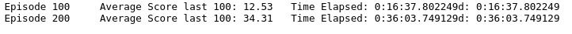
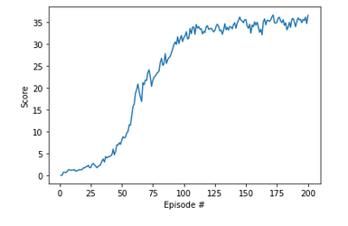

# Udacity Deep Reinforcement Learning
# Continuous Control 
Training agent to follow moving target

##### Table of Contents 
- [Project Description](#project-description)
    - [Environment](#environment)
    - [Learning algorithm](#learning-algorithm)
- [Plot of rewards](#plot-of-rewards)
- [Ideas for future Work](#ideas-for-future-work)
- [References](#references)

## Project Description
#### Environment
In this environment, agent aims to follow a moving rarget. A reward of +0.1 is provided for each step that the agent's hand is in the goal location. Thus, the goal of your agent is to maintain its position at the target location for as many time steps as possible.

The evironment space consists of 33 variables corresponding to position, rotation, velocity, and angular velocities of the arm. Each action is a vector with four numbers, corresponding to torque applicable to two joints. And action vector is number between -1 and 1.

#### Learning algorithm
The algorithm used here is a Deep Deterministic Policy Gradient (DDPG). A DDPG is composed of two networks: one actor and one critic.
During a step, the actor is used to estimate the best action, the critic then use this value as in a DDQN to evaluate the optimal action value function.
Both of the actor and the critic are composed of two networks. One local network and one target network. During backpropagation if the same model was used to compute the target value and the predication, it would lead to computational difficulty.
During the training the actor is updated by applying the chain rule to the expected return from the start distibution. The critic is updated as in Q-learnin, ie it compares the expected return of the current state to the sum of the reward of the choosen action + the expected return of the next state.

First structure I tried was the one form ddpg-pendulum preoject . I have adapted the code to work with multiple agents. I changed the activation function of critic from Relu to Leaky Relu and it made significant diffrence. I have also adapted the suggetions in benchmark section. Critic has gradient clipping applied and Agent learns every 4th time.

 The actor network is composed of 3 FC layers with Relu activation after the first and second layer and tanh after third layer.
 - First layer: input size - 33  and output size - 256
 - Second layer: input size - 256 and output size - 128
 - Third layer: input size - 128 and output size - 4

 The critic network is composed of 3 FC layers with Leaky Relu activation after the first and second layer.
 - First layer: input size - 33  and output size - 256
 - Second layer: input size - 256 and output size - 128
 - Third layer: input size - 128 and output size - 4

training hyperparameters are as follow:
- Buffer size: 1000000
- Batch size: 512
- gamma: 0.99
- tau: 0.001
- actor learning rate: 0.0001
- critic learning rate: 0.0003
- weight decay: 0
- update every: 4
- learn n time each iteration: 1

## Plot of rewards

The agent has been trained for 200 episodes.  

Here is the graph of the score evolution:  

## Ideas for future Work
To improve the stability of the model, batch normaization could be added. Batch normalisation permists obtaining a better gradient flow while insuring that distribution of the inputs to a given layer during training always follow a gaussian law.

## References
1. [PPO](https://arxiv.org/abs/1707.06347)
2. [A3C](https://arxiv.org/abs/1602.01783)
3. [D4PG](https://arxiv.org/abs/1804.08617)
4. [DDPG](https://arxiv.org/abs/1509.02971)
